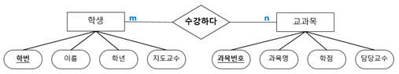
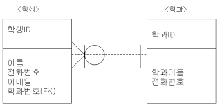

# DB 정리

### DB 시험 범위

1. 교과서 6, 7단원

2. 유인물 1 ~ 7

3. 회원가입 PPT

## 시험 정리

### 6단원. 데이터모델링

### 1. 데이터베이스 생명 주기

데이터베이스는 최초 사용자의 요구에 의해 구축되어 사용되다가 필요에 따라 개선 또는 다시 구축되어 사용한다.

이러한 데이터베이스의 생성과 운영에 관련된 특징을 **데이터베이스 생명 주기**라고 한다.

#### 생명주기 설명

1. **요구사항 수집 및 분석**

   사용자들의 요구사항을 듣고 분석하여 데이터베이스 구축의 범위를 정하는 단계이다.

   > 모델링 과정 : 현실 세계의 대상 및 사용자의 요구사항을 정리하고 분석한다.

2. **설계**

   개념적 설계(중요 개념을 구분) ▶ 논리적 설계(각 개념을 구체화) ▶ 물리적 설계(데이터베이스 생성 계획에 따라 계체, 인덱스 등을 생성)

   > 모델링 과정: 개체를 추출하고 각 개체들 간의 관계를 정의하여 ERD를 만드는 과정까지를 말한다.

3. **구현**

   설계 단계에서 생성된 스키마를 실제 DBMS에 적용하여 DB를 만듦.

   또한 관련 소프트웨어에 설계한 데이터베이스를 적용하여 서비스를 제공할 수 있도록 프로그램을 완성한다.

   > 모델링 과정: 
   > 
   > 1. 실제 필요한 모든 속성을 추출한다. (실제 DB 쿼리에 적용될 속성)
   > 
   > 2. 정규화를 수행한다. (7단원)
   > 
   > 3. 데이터의 표준화를 수행한다. (데이터의 형태 및 크기 등을 확정한다)

4. **운영**

   구현된 데이터베이스를 기반으로 소프트웨어를 구축하여 서비스를 제공

5. **감시 및 개선**

   데이터베이스가 지속적으로 운영될 수 있도록 변경 및 유지보수를 한다.

### 2. 학습지 1~3

#### 데이터베이스 업무시나리오에서 엔티티 도출 (학습지 1~2)

##### 도출 방법

1. 시나리오에서 명사를 구분한다.

2. 개념이 불분명한 것, 광범이한 것은 제거한다.

3. 엔티티타입의 특성이거나 속성의 값은 제거한다.

4. 포괄적인 업무 프로세스에 해당되는 명사는 제거한다.

5. 중복되는 명사는 제거한다.

6. 누락된 엔티티타입을 유추한다.

> ex) 인터넷에 회원을 등록하는 정보로는 회원번호, 주민번호, 주소, 전화번호, 전자메일, 휴대폰번호, 결제 방법이 있다.
> 
> | 엔티티 | 엔티티 설명   | 관련 속성                                |
> | --- | -------- | ------------------------------------ |
> | 회원  | 회원 등록 정보 | 회원번호, 주민번호, 전화번호, 전자메일, 휴대폰번호, 결제 방법 |

#### 데이터 모델링 - 속성(Attribute) (학습지 3)

##### 속성 : 정보를 나타내는 최소의 단위, 엔티티의 성질, 수량, 상태, 특성 등을 나타냄

##### 속성의 유형

- **기본 속성** : 해당 엔티티가 원래 가지고 있는 속성

- **설계 속성**: 원래 업무에는 존재하지 않지만 시스템의 효율성을 위해 임의로 추가되는 속성 (인덱스)

- **파생 (추출) 속성**: 다른 속성으로 계산이나 변형되어 생성되는 속성 (ex: 전과목 합계점수)

##### 속성 정의 시 고려 사항

1. 엔티티가 관리할 특성들인가?

##### 속성의 111 원칙

- 엔티티 타입 내에서 **한** 속성을 **한** 시점에 **한** 값을 가져야 한다. **※100% 시험에 나옴**

파생 (추출) 속성의 너무 많은 값으의 중복은 **무결성 문제**가 발생할 수 있음

### 3. 학습지 4 (ER모델, ER다이어그램)

ER 모델은 데이터 모델링 과정 중 개념적 모델링에 사용하는 모델이다. 세상의 사물을 개체와 개체 관의 관계로 표현한다.

ER 모델은 개체와 개체 간의 관계를 **ER 다이어그램 (ERD)** 으로 표현한다. 

#### 1.개체와 개체 타입

개체는 사람, 사물, 장소, 개념, 사건과 같이 유무형의 정보를 가지고 있는 독립적인 실체를 말한다.

개체는 비슷한 속성을 가진 **개체 타입**을 구성하며, 개체 집합으로 묶인다.

개체 타입은 프로그래밍 언어의 타입으로 생각하면 된다.

#### 2. ER 다이어그램 (ERD)

요구 분석 상황을 **그림**으로 그려 **관계**를 도출한 것

##### 1. 개체 관계 모델 (Entity Relationship Model)

* 구조화된 데이터에 대한 일련의 표현

* 설계 기밥 중 하나가 개체-관계 모델링

##### 2. 데이터베이스에서 관계란?

* 두 엔티티 사이의 논리적인 관계

* 두 엔티티간의 업무 연관성)

##### 3. ERD를 그리는 2가지 방법

* 피터 첸 표기법 (책에는 나와있으나 학습지에는 없다)

  

* IE 표기법 (학습지에 존재하는 표기법)

  

##### 관계 이름짓기 (위 그림에서)

* 학생은 학과에 소속된다

* 학과는 사원을 포함한다

**ERD 표기 방법은 학습지 참고**

##### 4. 관계의 차수 - 두 엔티티간 관계 사이의 참여 수를 표현

*  1:1 관계

  * 하나의 구매신청은 하나의 구매주문을 신청한다

  * 한 개의 구매주문에 대해 한 개의 구매 신청서 내용을 작성한다

* 1:N 관계

  * 한 부서에 여러명의 사원이 포함된다

  * 한명의 사원은 한 부서에 소속된다

* N:N 관계

  * 한 주문은 여러개의 제품을 포함한다

  * 한 제품은 여러개의 주문에 주문된다

>  ※ 0...1, 1, 1...N, 0...N 4가지 경우에 기호 외워놓을 것

##### 5. 관계의 종류

1. 기본 관계

   엔티티와 엔티티가 독립적으로 분리되어 있으며 상호간의 한 가지 관계만 존재하는 형태

2. 재귀 관계

   하나의 엔티티 내에서 엔티티와 엔티티가 관계를 맺고 있는 형태

3. 베타적 관계 (원 안에 X 기호)

   슈퍼타입의 엔티티가 반드시 하나의 서브타입에는 속하는 형태

   > 대구 소프트웨어 고등학교 2학년 학생은 소프트웨어과, 임베디드과 반드시 하나에 속해야 한다.
   > 
   > 슈퍼타입: 대소고 학생 / 서브타입: 소프트웨어과 학생, 임베디드과 학생

4. 포함 관계 (원 기호)

   슈퍼타입의 엔티티가 두 개 이상의 서브타입에 포함될 수 있는 관계

   > 접수를 방문접수, 인터넷 접수 두 가지로 할 수 있다면 인터넷 접수를 한 사람은 다시 방문접수를 할 수 있다.
   > 
   > 슈퍼타입: 접수 / 서브타입: 방문접수, 인터넷 접수

5. 식별 관계 (실선)

   1. 부모 없이는 자식이 존재할 수 없는 관계이다

   2. 부모의 **식별자**가 자식의 **식별자**로 상속된다

   > 여기서 식별자는 PK(Primary Key)로 보면 된다

6. 비식별 관계 (점선)

   1. 부모 없이도 자식이 존재할 수 있는 관계이다

   2. 부모의 **식별자**가 자식의 **속성**으로 상속된다.

   > 회원 없이도 주문이 가능할 수 있을 때 (비회원 주문이 존재), 회원과 주문은 비식별 관계이다.

   

