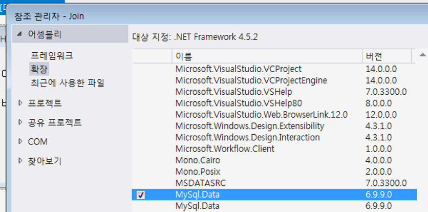

# DB-회원가입 PPT

## 참조 추가



## App.Config 수정

```xml
<appSetting>
    <add key="DBConn"
         value="Data Source=127.0.0.1;Database=member;User Id=root;Password=1234" />
</appSetting>
```

## 비밀번호 암호화

```csharp
public string ConvertSha256(string Pwd) // SHA256 (단방향 암호화) 사용
{
    var Sha256 = new SHA256CryptoServiceProvider();
    // ComputeHash : 지정된 바이트 배열에 대해 해시 값을 계산
    byte[] ResultHash = Sha256.ComputeHash(Encoding.Default.GetBytes(Pwd));
    // ResultHash = [123, 32, 72, 30, 180, 200, ...] 이런 데이터들 저장돼있음
    StringBuilder TransPwd = new StringBuilder();
    foreach (var hash in ResultHash)
    {
        // string에 한 hash(0~256)에 대해 16진수 2자리(00~ff)로 변환한 값을 붙임
        TransPwd.AppendFormat("{0:x2}", hash);
    }
    return TransPwd.ToString();
}
...
// 사용
string pwd = ConvertSha256("1234");
//pwd = 03AC674216F3E15C761EE1A5E255F067953623C8B388B4459E13F978D7C846F4
```

**SHA256 알고리즘은 단방향 암호화 알고리즘이다.**

- 단방향으로 암호화 된 비밀번호를 비교하는 방법은 둘다 암호화 해서 같은지 비교해야한다.

  사용자가 입력된 값을 SHA256으로 암호화 한뒤 데이터베이스에 저장되어 있는 SHA256데이터와 비교하여 같은지 다른지 비교한다.

## Using

#### 프로젝트에서 Mysql과 Configure파일 참조

```csharp
using MySql.Data.MySqlClient;
//DB 연결을 위한 메소드, 클래스 사용
using System.Configuration;
// App.Config파일에 작성한 데이터를 불러오기 위해서 사용 (참조 추가해야함)
...
// Config에서 불러오기
private string StrSQL = ConfigurationManage.AppSetting["DBConn"];
```

## MySQL 관련 메소드 사용

```csharp
private bool IDCheck()
{
    var Conn = new MySqlConnection(StrSQL);
    Conn.Open();
    // Select 예제
    var Command = new MySqlCommand("select * from mem_join where id='" + this.txtId.Text + "'", Conn);
    var MyRead = Command.ExecuteReader();
    // 예제엔 while로 돼있는데 왠진 몰겠다.
    if (MyRead.Read())
    {
        MessageBox.Show("동일한 아이디가 존재합니다");
    }
}
// Insert, Update, Deiete 같은 DML 실행 원할시 사용 (리턴 값이 없을 때)
private void ExecuteNonQuery(string query)
{
    var Command = new MySqlCommand(query, Conn);
    int i = Command.ExecuteNonQuery();
    // 이 i 값은 바뀐 행의 갯수를 의미한다
}
```
