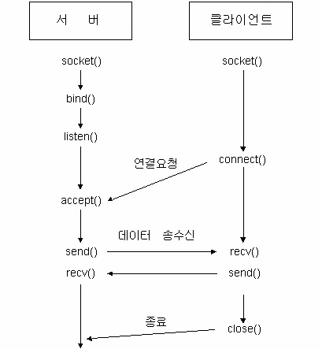

# 네트워크

<p align="center">
      <a href="https://github.com/tbvjaos510/DGSW-Exam#1%EC%9D%BC%EC%B0%A8">
            
      </a>
</p>

### 시험범위

- 학습자료 1 ~ 26?? 진도 더나가는중

- 59p ~ 218p??

### 학습지 무조건 보세요. 이건 참고용입니다.

## 1. 학습자료 1 - INetAddress 클래스

#### INetAddress는 IP주소를 나타내는 클래스이다.

| 반환자료형                  | 메소드                    | 설명                             | 예시 (상세설명)                                                                      |
| ---------------------- | ---------------------- | ------------------------------ | ------------------------------------------------------------------------------ |
| `byte[]`               | `getAddress()`         | IP주소를 byte배열로 반환               | `[83, -90, -87, -25]` (signed로 반환)                                             |
| `static InetAddress[]` | `getAllByName()`       | 도메인명에 지정된 모든 호스트의 IP주소를 배열로 반환 | `www.naver.com, getHostAddress()`\[125.209.222.242, 210.89.164.90 \]           |
| `static InetAddress`   | `getByAddress(byte[])` | byte배열을 통해 IP주소를 얻음            | `getByAddress(new byte[] {83, -90, -87, -25})`                                 |
| `static InetAddress`   | `getByName(String)`    | 도메인 명을 통해 IP주소를 얻음             | getByName("www.naver.com")                                                     |
| `String`               | `getHostAddress()`     | 호스트의 IP주소를 반환                  | 83.166.169.231                                                                 |
| `String`               | `getHostName()`        | 호스트의 이름을 반환                    | 도메인을 알 수있으면 도메인, 모르면 IP주소를 반환 (getByName이나 getAllByName으로 생성해야지만 도메인을 알 수 있음.) |
| `static InetAddress`   | `getLocalHost()`       | LocalHost의 IP주소 반환             | DESKTOP-RSTHVDI/10.80.162.54                                                   |
| `boolean`              | `isLoopbackAddress()`  | loopback주소인지 확인                | loopback=127.0.0.1                                                             |
| `boolean`              | `isMulticastAddress()` | 멀티캐스트 주소인지 확인                  | 아래에서 확인                                                                        |

> 멀티캐스트 주소란??
> 
> 멀티캐스트 그룹에 참여하는 구성원을 확인하기 위한 주소. 주소범위는 224.0.0.5 ~ 239.255.255.255
> 
> 예약된 주소이다.

## 2. 학습자료 2 - NetworkInterface 클래스

#### NetworkInterface 클래스는 네트워크에서 노드로 작동하는 디바이스에 접속하는 수단을 제공한다.

무선 LAN 또는 블루투스 연결을 위한 무선 같은 것들을 가지고 있다.

| 반환자료형                                  | 메소드                     | 설명                                       | 예시                                                        |
| -------------------------------------- | ----------------------- | ---------------------------------------- | --------------------------------------------------------- |
| `static Enumeration<NetworkInterface>` | `getNeworkInterfaces()` | 시스템 내 존재하는 모든 네트워크 디바이스의 리스트를 얻음         | ip, 기기 이름 전부 나온다.                                         |
| `static NetworkInterface`              | `getByName(String)`     | 주어진 interfaceName으로 특정 네트워크 디바이스의 객체를 얻음 | `("lo").getDisplayName()` "Software Loopback Interface 1" |
| `string`                               | `getDisplayName()`      | 네트워크 디바이스의 이름을 얻음                        | 위 예시 참고                                                   |
| `string`                               | `getName()`             |                                          |                                                           |

현재 작업안하는 중이다. 너무많아서 정리가 힘들다.

아래부터 보자.

## 중요 클래스 메소드들

### 채널과 버퍼

* **버퍼** (`Buffer`) : jdk1.3 부터 자바 IO의 한계를 보완한 자바 NIO (non-blocking IO)중 하나이다.

  >  버퍼에는 `ByteBuffer`, `CharBuffer`, `IntBuffer` 등등 여러 종류가 있다. 우리는 `ByteBuffer`만 사용한다.

  `Buffer`에는 위치를 나타내는 포인터가 네가지가 있다.

  * `position()` : 현재 읽을 위치나 쓸 위치를 가리킨다. `get()` 함수로 읽기를 시도할 경우 `position` 위치부터 읽기 시작하며 `put()` 함수로 쓰기를 시도할 경우 `position` 위치부터 쓰기 시작한다.

  * `limit()` : 현재 `Buffer`의 유효한 쓰기 위치나 유효한 읽기 위치를 나타낸다.

    "이 버퍼는 여기까지 읽을 수 있다." 혹은 "이 버퍼는 여기까지 쓸 수 있다"를 나타낸다.

  * `capacity()` : `Buffer`의 용량을 나타낸다. 항상 `Buffer`의 맨 마지막을 가리키고 있다.

    > `limit`와 `capacity`의 차이는?
    > 
    > 쓰기모드에서 `limit`와 `capacity`의 값은 같다.
    > 
    > 하지만 읽기 모드에서는 `limit`는 읽을 수 있는 데이터의 양을 의미하고
    > 
    > `capacity`는  버퍼 자체의 크기를 의미한다. (배열을 생각해보자)
    > 
    > ```java
    > String str[] = new String[5];
    > str[0] = "aaa";
    > str[1] = "bbb";
    > ```
    > 
    > 이 때, 배열의 총 크기는 5 (capacity)이지만 실제 데이터의 양은 2 (limit)이다.
    > 
    > 물론 배열와 버퍼의 의미는 많이 다르지만 `limit`와 `capacity`의 의미는 이렇게 생각해놓으면 될 것 같다.
    > 
    > [참고한 사이트](https://stackoverflow.com/questions/23148729/what-is-the-difference-between-limit-and-capacity-in-bytebuffer) (여기서 그림만 대충 보자)

  * `mark()` : 사용자가 따로 저장하는 위치이다. (mark 그대로 해석) 미리 저장해 뒀다가 `reset()` 호출 시 `mark()` 해뒀던 포인터로 돌아간다. (뒤에 UDP 채널 멀티캐스트 서버에서 나온다.)

  위의 포인터들은 다음과 같은 규칙을 가진다

  `0 <= mark <= position <= limit <= capacity`

  다음은 `Buffer`의 메소드를 보자.

  * `get()` : 데이터만 가지고 온다. `position`을 감소시킨다.

    `ByteBuffer`일 경우 `byte`하나만 반환, `IntBuffer`일 경우 `int` 하나만 반환. 

    `get()`은 오버로딩 되어서 여러개 들고올 수도 있고 특정 인덱스만 들고올 수 있다.

  * `put()` : 데이터를 추가한다. `array`도 되고 `byte` 하나도 된다. `position`을 추가된 값 뒤로 변경한다.

  * `warp()` : 입력된 배열을 사용하여 버퍼를 생성한다. 입력에 사용된 배열이 변경되면 wrap를 사용해서 생성한 `Buffer`도 변경된다.

  * `filp()` : `position`을 처음으로 옮긴다.

  * `hasRemaining()` : 아직 버퍼에 남은 데이터가 있는지 여부 (Boolean)

    >  `position` 과 `limit` 가 같으면 `false`, 아니면 `true` 반환  

* **채널** : `Buffer`에 있는 내용을 다른 어디론가 보내거나 다른 어딘가의 내용을 `Buffer`로 읽어들이기 위해 사용된다. 

  소켓 프로그래밍에서는 `ServerSocketChannel`, `SocketChannel`을 이용하여 소켓에 `ByteBuffer`를 전송시킨다.

## TCP 소켓 사용

* TCP 소켓의 단계

  

* 소켓의 사용

  서버에서는 `ServerSocketChannel`로 서버를 열고 클라이언트에서는 `SocketChannel`로 서버에 연결한다.

  대신 서버에서도 클라이언트와 통신하기 위해서는 `SocketChannel`을 사용한다.

  ##### 서버

  ```java
  public static void main(String[] args) {
      try {
          // 서버 소켓 생성
          ServerSocketChannel serverSocketChannel = 
                              ServerSocketChannel.open();
          // 5000번 포트를 사용 (bind)
          serverSocketChannel.socket().bind(new InetSocketAddress(5000)); 
          // 클라이언트 요청을 받아서 클라이언트 연결 정보를 담은 SocketChannel 반환
          SocketChannel socketChannel = serverSocketChannel.accept(); // 받을 때 까지 대기한다.
          System.out.println("클라이언트 연결됨!");
          // 보낼 데이터 생성
          String message = "Hello World!";        
          // 보낼 데이터를 담는 ByteBuffer 생성 및 할당
          ByteBuffer buffer = ByteBuffer.allocate(64); // 이 64가 capacity이다.
          // buffer에 데이터를 넣는다.
          buffer.put(message.getBytes());
          // buffer의 position을 초기화한다.
          buffer.flip();
          // 클라이언트로 전송함
          while (buffer.hasRemaining()) {
              socketChannel.write(buffer);
          }
      } catch (IOException ex) {
          ex.printStackTrace();
      }
  }
  ```

  ##### 클라이언트 (몇몇 주석은 생략)

  ```java
  public static void main(String[] args) {
      // 주소를 127.0.0.1(LoopBack, 로컬), 포트 5000으로 설정
      SocketAddress address = new InetSocketAddress("127.0.0.1", 5000);
      // 서버에 연결을 한다. 약 1초간 시도 후 연결이 안되면 exception 발생. 아래 1번 참고
      try(SocketChannel socketChannel = SocketChannel.open(address)) {
          System.out.println("서버에 연결하였습니다.");
          ByteBuffer byteBuffer = ByteBuffer.allocate(64);
          String message = "";
          // 소켓 채널에서부터 값을 받아 byteBuffer에 저장한다. 
          socketChannel.read(byteBuffer);
          // 현재 byteBuffer의 position은 값이 들어가서 limit까지 찼을 것이다. 처음으로 옮긴다. 
          byteBuffer.flip();
          while (byteBuffer.hasRemaining()) {
              // message에 byteBuffer로부터 받은 byte하나를 char형으로 변환해서 추가함 
              message += (char) byteBuffer.get();
          } // 이를 byteBuffer에 값이 없을 때 까지 하나씩 전부 옮김
          System.out.println("서버로부터 받은 값 : " + message);
      } catch (IOException ex) {
          ex.printStackTrace();
      }
  }
  ```

  1. 여기서 `try` 괄호 안에 코드를 넣었는데,  이는 `try{}` 중괄호 밖으로 벗어나면 자동으로 `socketChannel.close()`가 실행된다. 이를 **[try-with-resource](http://multifrontgarden.tistory.com/192)** 구문이라고 부르는데, 참고하자. 

  저 위의 예제들이 tcp에서 서버와 클라이언트의 기본이다. 저것만 이해하면 나머지들도 쉽게 이해할 수 있다.

## UDP 소켓 사용

UDP 는 비연결성 프로토콜이다. 연결하지 않고 패킷을 전달하는데, `DatagramSocket`이란 클래스를 사용한다.

* 서버

  서버의 단계는 전체적으로 3단계이다.

  1. `DatagramSocket`생성 : 생성 시, Listen할 포트를 지정해야한다. (여기까진 TCP와 같다.)

  2. `DatagramPacket`생성 : 받은 데이터를 저장해야 할 패킷을 생성해야 한다. (`ByteBuffer` 같은거)

  3. `datagramSocket.receive(datagramPacket)` 호출 : `receive`를 호출하면 받을 때 까지 대기한다.

     > 저기서 datagramSocket과 datagramPacket은 인스턴스이다. 즉 new로 할당된 값 

* 클라이언트

  클라이언트 단계도 3단계로 보면 된다.

  1. `DatagramSocket` 생성 : 생성 시, 패킷을 전송할 서버IP와 포트를 적어도 되고, 안적어도 된다.

     > 다만 학습지에 있는 예제에서는 적지 않았다.

  2. `DatagramPacket` 생성 : 생성자에서 인자값을 두 가지 방법으로 만들 수 있다.

     1. `DatagramSocket` 생성 시, 전송할 서버 IP와 포트를 적었을 때

        ```java
        new DatagramPacket(sendMessage, sendMessage.length);
        ```

     2. `DatagramSocket` 생성 시, 서버IP와 포트를 안 적었을 때 (더 깊게 봐놓자)

        ```java
        new DatagramPacket(sendMessage, sendMessage.length, serverInetAddr, serverPort);
        ```

  3. `datagramSocket.send(datagramPacket)` 호출 : 서버로 데이터를 전송한다.

     > 역시나 datagramSocket과 datagramPacket은 인스턴스이다.

  예제 코드를 보자.

* **서버**

  ```java
  public static void main(String[] args) {
      System.out.println("UDP Server Started");
      // UDP 서버 생성 (5000포트로 listen)
      try (DatagramSocket serverSocket = new DatagramSocket(5000)) {
          while (true) {
              // 받을 데이터를 저장할 byte 생성 
              byte[] receiveMessage = new byte[1024];
              // 받을 데이터를 저장할 패킷 생성
              DatagramPacket receivePacket = 
                             new DatagramPacket(receiveMessage, receiveMessage.length);
              // 클라이언트로 부터 수신대기. receivePacket에 클라이언트 데이터가 저장됨
              serverSocket.receive(receivePacket);
              // byte[]를 String형으로 변환
              String message = new String(receivePacket.getData());
              System.out.println("Receive from client: [" + message + "]");
              // 여기부터는 받은 곳으로 데이터를 다시 전송하는 것이다.
              // 받은 패킷의 주소를 저장한다.
              InetAddress inetAddress = receivePacket.getAddress();
              // 받은 패킷의 포트를 저장한다
              int port = receivePacket.getPort();
              // 보낼 메시지를 받은 메시지랑 같게 한다.
              byte[] sendMessage;
              sendMessage = message.getBytes();
              // 여기서는 serverSocket에 보낼 곳의 정보가 존재하지 않기 때문에 DatagramPacket에 적음.
              DatagramPacket sendPacket =
                             new DatagramPacket(sendMessage, sendMessage.length, inetAddress, port);
              // 패킷을 패킷에 적힌 주소로 전달
              serverSocket.send(sendPacket);
          }
      }
  }
  ```

* **클라이언트**

  ```java
  public static void main(String[] args) {
      System.out.println("UDP Client Started");
      // 스캐너 사용
      Scanner scanner = new Scanner(System.in);
      // 클라이언트 소켓은 생성자의 인자값이 없이 생성함.
      try (DatagramSocket clientSocket = new DatagramSocket()) {
          // 보낼 주소를 적음. 한 컴퓨터에서 돌릴 거니까 localhost로.
          InetAddress inetAddress = InetAddress.getByName("localhost");
          byte[] sendMessage;
          while (true) {
              System.out.print("Enter a message : ");
              // 사용자의 입력을 받음.
              String message = scanner.nextLine();
              // byte[] 로 변환함
              sendMessage = message.getBytes();
              // DatagramPacket 생성
              DatagramPacket sendPacket = new DatagramPacket(
                  sendMessage, sendMessage.length, inetAddress, 5000);
              // 서버로 패킷을 전송한다.
              clientSocket.send(sendPacket);
              // 받을 패킷을 생성한다.
              byte[] receiveMessage = new byte[1024];
              DatagramPacket receivePacket = new DatagramPacket(
                  receiveMessage, receiveMessage.length);
              // 서버로부터 데이터를 받는다. 1번 참고.
              clientSocket.receive(receivePacket);
              String receivedSentence = new String(receivePacket.getData());
              System.out.println("Received from server [" + receivedSentence + "]");
              System.out.println("From " + receivePacket.getSocketAddress());
          }
      }
  }
  ```

  1. 여기서 보면 `clientSocket`은 포트를 설정하지 않았지만 서버로부터 `receive()`를 수행한다. 이게 가능한 이유가 서버에서 `getPort()`를 했을 때 값은 41032(다를 수 있다) 대충 이런 클라이언트 패킷에서 보낸 임시 포트가 나오는데, 클라이언트에서 `sendPacket`을 전송할 때 보내는 임시포트는 `clientSocket`에 암시적으로 저장이 된다. 그리고 `receive`를 호출하면 `send()`했던 임시 포트를 이용해  receive를 한다. - [참고 자료](https://stackoverflow.com/a/29337540)

## UDP 멀티캐스팅

멀티캐스팅은 동일한 시간에 다수의 클라이언트에 메시지를 전송하는 프로세스다.

그래서 멀티캐스트에 참여를 해야 하는데, 기존 IPv4 클래스 D공간과 224.0.0.0~239.255.255.255의 주소를 사용한다.

> 교과서엔 위처럼 나와 있는데 IPv4 D클래스가 224.0.0.0~239.255.255.255다. 그냥 IPv4 D클래스만 사용한다고 보자.

사실 멀티캐스트에는 서버, 클라이언트의 개념이 애매하다. 걍 모두가 방에 접속해서 send, receive하여서 데이터를 주고받는다. 여기서는 보내는 역할이 서버, 받는 역할이 클라이언트로 보는거 같다.

* 서버

  ```java
  public static void main(String[] args) {
      System.out.println("UDP Multicasts Server Started");
      try {
          // 멀티캐스트 소켓을 생성한다.
          MulticastSocket multicastSocket = new MulticastSocket();
          // 연결할 멀티캐스트 방의 주소 생성
          InetAddress inetAddress = InetAddress.getByName("228.5.6.7");
          // 방에 참여
          multicastSocket.joinGroup(inetAddress);
          // 데이터를 전송한다. DatagramPacket이라서 UDP와 같다.
          byte[] data;
          DatagramPacket packet;
          while (true) { // 1초마다 데이터를 전송한다.
              Thread.sleep(1000); // 1초 대기
              String message = "Hello!";
              System.out.println("Send : " + message);
              data = message.getBytes();
              // 패킷을 만든다. 기존 UDP와 크게 다른게 없다.
              packet = new DatagramPacket(data, message.length(),
                  inetAddress, 5000);
              // 전송
              multicastSocket.send(packet);
          }
      } catch (IOException | InterruptedException ex) {
         e.printStackTrace();
      }
  }
  ```

* 클라이언트

  ```java
  public static void main(String[] args) {
      System.out.println("UDP Multicast Client Started");
      try {
          // 포트를 지정한 상태로 소켓 생성
          MulticastSocket multicastSocket = new MulticastSocket(5000);
          // 역시나 클라이언트도 방에 참여한다.
          InetAddress inetAddress = InetAddress.getByName("228.5.6.7");
          multicastSocket.joinGroup(inetAddress);
          
          // 받을 패킷을 생성
          byte[] data = new byte[256];
          DatagramPacket packet = new DatagramPacket(data, data.length);
          
          while(true) {
              // 멀티캐스트 서버에서 패킷을 수신한다.
              multicastSocket.receive(packet);
              // String 생성자의 인자값이 3개인데, (bytes, offset, length) 이다.
              // 즉 문자열의 0부터 packet의 길이만큼 패킷의 데이터를 가지고 온다는 것이다. 1번 참고
              String message = new String(packet.getData(), 0, packet.getLength());
              System.out.println("Message from: " + packet.getAddress()
                      + " Message: ["+ message + "]");
          }
          
      } catch (IOException ex) {
          ex.printStackTrace();
      }
  }
  ```

  1. 그냥`new String(packet.getData())` 해도 같은 결과가 나온다. 왜 쓴지는 모르겠다.

## 비동기 소켓

비동기 통신은 요청을 하고 그 요청이 완료될 때까지 대기하지 않고 다른 작업을 진항해는 것이다.

이를 **논블로킹**(non-blocking)이라고 부른다.

* `Future` 인터페이스 : 보류 결과를 나타내는 인터페이스인데, 실행 중이고 블록 중이 아닌  실행 상황을 저장한다.

  제네릭을 사용하는게 일반적인데 제네릭 안에는 반환하는 값을 넣는다, `Future`은 값을 반환하는데 몇 초가 걸리는 작업들에 대해 나타내기 때문이다. 하지만 소켓에서는 리턴 값이 필요없는 작업들이 있기 때문이 제네릭을 안쓰기도 한다.

  > javascript를 어느 정도 아는 사람은 Promise 개념과 같다라고 알면 된다.

  Future은 즉시 리턴이 되며 아래 방법으로 값을 가지고 올 수 있다. (밑에 방법이 더 있다.)

  ```java
  Future<Integer> future = sometask;
  System.out.println("작업 진행 중");
  System.out.println("결과 : " + future.get());
  ```

  출력 결과는

  ```java
  작업 진행 중
  결과 : 4 (그냥 값)
  ```

  이렇게 나오는데, 일단 중요 메소드부터 살펴보자

  * `future.get()` : 메소드에서 값을 리턴할 때까지 대기(블록킹)한다. 그러고 값을 리턴한다.

    * `future.get(long timeout, TimeUnit unit)` : 대기하지만 설정해놓은 시간이 지나면 `TimeoutException`이 발생한다. 

  * `future.isDone()` : 메소드에서 값이 리턴됐으면 `true`반환, 아니면 `false`반환

    그래서 보통 값을 불러오는 방법이 3가지가 있다.

    ```java
    // 1
    int result = future.get();
    // 2
    while (!future.isDone());
    int result = future.get(); // 값을 리턴할 필요가 없으면 안 쓰면 된다.
    // 3
    try {
        int result = future.get(10, TimeUnit.SECONDS);
    } catch (TimeoutException ex) {
        System.out.println("타임아웃");
    }
    ```

* 그러면 비동기 서버와 클라이언트를 보자. (TCP다)

  TCP와 비슷한 부분도 꽤 많다. 

  **서버**

  ```java
  public static void main(String[] args) {
      // 서버를 연다 (이름이 드럽게 길다)
      try (AsynchronousServerSocketChannel serverChannel = AsynchronousServerSocketChannel.open()) {
          // 연결할 서버 IP
  		InetSocketAddress hostAddress = new InetSocketAddress("localhost", 5000);

  		serverChannel.bind(hostAddress); // bind 한다.

  		System.out.println("Waiting for client to connect...");

  		// Future을 리턴하는데, 이는 대기하지 않고 바로 다음을 실행한다
  		Future acceptResult = serverChannel.accept();

  		System.out.println("Waiting Accept...");
  		
  		// 하지만 여기서 .get()을 호출했으므로 여기서 대기하게 된다.
  		try (AsynchronousSocketChannel clientChannel = (AsynchronousSocketChannel)acceptResult.get())

  		{
  			System.out.println("Messages from cilent: ");
  			// clientChanel이 null이 아니거나 열리지 않았을 때 1번 참고

  			while ((clientChannel != null) && (clientChannel.isOpen())) {

  				ByteBuffer buffer = ByteBuffer.allocate(32);
  				// AsynchronousServerSocketChannl의 거의 모든 소켓 메소드는 Future로 반환한다.

  				Future result = clientChannel.read(buffer);

  				

  				// Timeout 10초 설정 2번 참고

  				result.get(10, TimeUnit.SECONDS);

  				// Position을 초기화 시킨다. 3번 참고
  				buffer.flip();

  				// 역시나 3번 참고
  				String message = new String(buffer.array()).trim();

  				System.out.println(message);

  				if (message.equals("quit")) {

  					break;

  				}

  			}

  		}			

  	} catch (IOException | InterruptedException | ExecutionException | TimeoutException ex) {

  		ex.printStackTrace();

  	}
  }
  ```

  1. 여기서 while문을 쓰는 이유는 `acceptResult.get` 에서 `accept` 오류가 발생한 경우를 체크하기 위한 것이다.

  2. 저 `result.get()`은 위에서 본 Future 값을 불러오는 방법 3가지가 전부 가능하다.

  3. 여기서 `buffer.flip()` 이 의미가 없다. `buffer.array()`는 현재 Position을 무시하고 모든 값을 받아온다.

     [여기](https://code.i-harness.com/ko-kr/q/a5d82) 참고

  **클라이언트**

  ```java
  public static void main(String[] args) {
      // client 생성
  	try (AsynchronousSocketChannel client = AsynchronousSocketChannel.open()) {

  		InetSocketAddress hostAddress = new InetSocketAddress("localhost", 5000);
  		// 서버에 연결 (Future 반환)

  		Future future = client.connect(hostAddress);
  		// 여기서 연결을 기다린다.

  		future.get();

  		System.out.println("Client is started: " + client.isOpen());

  		System.out.println("Sending message to server: ");

  		Scanner scanner = new Scanner(System.in);

  		String message;

  		while(true) {

  			System.out.print("> ");

  			message = scanner.nextLine();

  			// warp 메소드는 위에 Buffer 메소드 설명에 있다. message의 바이트로 버퍼 생성
  			ByteBuffer buffer = ByteBuffer.wrap(message.getBytes());

  			// write한다. (Future) 반환
  			Future result = client.write(buffer);
  			// 대기. 역시나 3방법 전부 가능

  			while (!result.isDone()) {

  			}

  			if (message.equalsIgnoreCase("quit")) {

  				scanner.close();

  				break;

  			}

  		}

  	} catch (IOException | InterruptedException | ExecutionException ex) {

  		ex.printStackTrace();

  	}

  }
  ```


