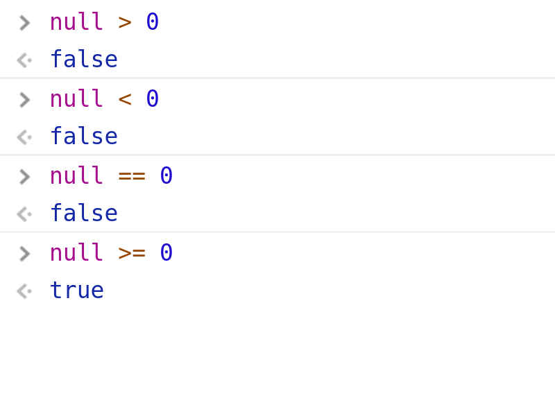

# 웹 프로그래밍

## 셤 범위

* 학습지 1~5

### 갓갓언어 Javascript



#### 밑에 나오는 코드 예제 들은 코딩 스타일 규칙 그런거 안지킵니다.

무조건 학습지 위주로만 합니당.

또한 **예제 코드들은 전부 Chrome Developer Tools의 Console에서 작동시켰습니다.**

## 학습지 1 - JS 코어 객체1

#### Javascript는 객체 기반 언어이다.

정확히는 프로토타입 기반 프로그래밍 언어라고 부른다. (학습지엔 없다.) ~~하지만 [ES6](https://github.com/FEDevelopers/tech.description/wiki/%5BES6%5D%EA%B0%9D%EC%B2%B4%EC%A7%80%ED%96%A5-Javascript---Class) 부턴...~~

일단 이부분은 논쟁이 많으므로 학습지에 나온대로 외우자.

* JS는 캡슐화, 상속, 다형성 특징을 완벽히 갖추지 못하고 단순히 여러 객체들이 활용되는 언어이다.

### 자바스크립트 객체의 유형

1. 코어 객체

   > 기본 객체, Array, Date, String, Math 타입 등. 웹 페이지나 서버 어디서나 사용 가능

2. HTML DOM 객체

   > HTML 내용과 모양을 제어하기 위해 사용되는 객체

3. 브라우저 관련 객체

   > 브라우저 종류, 스크린 크기 정보, 새 윈도우 생성 등 브라우저와 관련된 객체이다.

#### 객체 생성

```javascript
var today = new Date();
var message = new String("Hello web world");
```

> 객체의 삭제는 Garbage Collection 기법으로 소멸된다. 즉 우리는 신경 안써도 됨.

#### 객체 정의 및 접근

```javascript
var test = {
  num: 0, // 프로퍼티
  add: function () {
    this.num++; // this로 현재 객체의 프로퍼티와 메소드에 접근이 가능하다.
  } // 메소드
}; // 정의

test.num = 4; // 객체 프로퍼티 값 변경
test.add(); // 객체 메소드 호출
console.log(test.num); // 5
```

### Array 객체

* 배열은 [] 로 정의하거나 Array객체로 배열을 만든다.

  ```javascript
  var numbers = [1, 2, 3, 4, 5]; // []로 정의
  var numbers = new Array(1, 2, 3, 4, 5); // new Array로 정의
  var arr = [3, "hello", 0.7, new Date()]; // 여러 형들을 한번에 넣을 수도 있다.
  ```

* 배열에 접근할려면 0에서 시작하는 인덱스로 접근

  ```javascript
  numbers[2] = 4; // [1, 2, 4, 4, 5]
  numbers[5] = 6; // [1, 2, 4, 4, 5, 6]
  
  // 궁굼증! 배열의 인덱스를 뛰어넘는 값을 넣어보자
  numbers[12] = 20; // [1, 2, 4, 4, 5, 6, empty x 6, 20] (chrome developer tools)
  // 이상태에서 사이 값에 접근을 하면?
  numbers[8]; // undefined
  ```

* 배열의 메소드들

  * `length` : 배열의 크기를 나타냄 **메소드가 아니다!**

    ```javascript
    var keys = [50, 70, 100];
    console.log(keys.length); // 3
    ```

    > 그러면 인덱스를 뛰어넘는 값을 넣으면 어떻게 될까?
    > 
    > ```javascript
    > keys[10] = 30;
    > console.log(keys.length); // 11
    > ```

  * `concat(arr)` : 배열과 인자배열을 합친 새로울 배열 생성

    ```javascript
    var numbers = [1, 2, 3];
    var alls = numbers.concat([4, 5, 6]);
    console.log(alls); // [1, 2, 3, 4, 5, 6]
    console.log(numbers); // [1, 2, 3]
    ```

    **※주의** concat을 사용하면 리턴값이 합친 배열이고 기본 배열은 변환이 안된다.

  * `join(separator)` : 배열의 모든 요소를 하나의 문자열로 연결한 문자열로 반환.

    ```javascript
    [1, 3, 5, 6].join(2); // "1232526"
    [1, 2, 4, 5].join('-'); // "1-2-4-5"
    ["a", "b", "c", "d"].join('##'); // a##b##c##d
    ```

  * `reverse()` : 배열을 뒤집음

    ```javascript
    [1, 2, 3, 4].reverse(); // [4, 3, 2, 1]
    ```

  * `slice(start [, end])` : 배열을 A에서 B까지 반환. B가 없으면 A부터 끝까지 반환.

    ```javascript
    [1, 2, 3, 4, 5, 6].slice(1, 3); // [2, 3, 4]
    [1, 2, 3, 4, 5, 6].slice(4); // [5, 6]
    ```

  * `sort()` : 배열 요소 정렬

    ```javascript
    [6, 7, 3, 2, 5].sort(); // [2, 3, 5, 6, 7]
    ["b", "a", "c", "f", "d"].sort(); // ["a", "b", "c", "d", "f"]
    ```

    문자열은 사전 순으로 정렬한다.

    ```javascript
    ["ba", "bc", "ac", "bb", "ca", "a"].sort(); // ["a", "ac", "ba", "bb", "bc", "ca"]
    ```

  * `toString()` :  문자열로 반환

    ```javascript
    [1, 2, 4].toString(); // "1,2,4"
    ["a", "b", "c"].toString() // "a,b,c"
    ```

* 학습지엔 나오지 않지만 출제 가능성이 조금 있는 메소드를 소개하겠다.

  * `push(value), pop()` : 배열에 값을 추가, 삭제.

    ```javascript
    var a = [1, 2, 3];
    a.push(4); // 리턴 값 : 4
    console.log(a); // [1, 2, 3, 4]
    a.pop(); // 리턴 값 : 4
    console.log(a); // [1, 2, 3]
    ```

  * `indexOf(value)` : 배열에서 value값의 index 반환 못 찾을시 -1 반환

    ```javascript
    [50, 100, 250, 70, 30].indexOf(100); // 1
    ["a", "b"].indexOf("c"); // -1
    ```

### Date 객체

시간 정보를 담는 객체이다.

* 생성자

  ```javascript
  var now = new Date(); // 현재 시간으로 자동으로 초기화 됨.
  var christmas = new Date(2018, 11, 25); // 년,월,일로 초기화 시분초는 0이 된다.
  // 월은 0에서 11까지다
  var birthday = new Date(2001, 10, 18, 02, 25, 18); // 년, 월, 일, 시, 분, 초로 초기화
  ```

* 주요 메소드들

  * `set/getFullYear()` : 현재 년도 설정/가져오기

    ```javascript
    var time = new Date(2018, 0, 1);
    console.log(time.getFullYear()); // 2018
    time.setFullYear(2017);
    console.log(time.toLocaleString()); // "2017. 1. 1. 오전 12:00:00"
    ```

  * `set/getMonth()` : 현재 월 설정/가져오기, **월은 0에서 11까지**

  * `set/getDate()` : 현재 날짜 설정/가져오기 (1부터 시작)

  * `set/getDay()` : 현재 요일 설정/가져오기 (0~6, 일~토)

    > Date와 Day를 헷갈리지 말자. 
    > 
    > ```javascript
    > var time = new Date(2018, 4, 5); // 어린이날
    > console.log(time.getDate()); // 5
    > console.log(time.getDay()); // 6 어린이날은 토요일이다
    > ```

  * `set/getHour()` : 현재 시간 설정/가져오기  (0~23)

  * `set/getMinutes()` : 현재 분 설정/가져오기 (0~59)

  * `set/getSeconds()` : 현재 초 설정/가져오기 (0~59)

  * `set/getMilliseconds()` : 현재 밀리초 가져오기 (0~1000)

  * `set/getTime()` : 1970년 1월 1일 자정과의 밀레세컨드 차이 설정/가져오기

    ```javascript
    new Date().getTime(); // 1543057901288
    ```

## 학습지 2 - JS 코어 객체 2

### Math 객체

수학 계산을 위한 객체이다.

* 따로 생성하지 않고 사용한다. (`Math.abs()` 이렇게)

* 주요 프로퍼티, 메소드들 (누가 시간되면 예제 추가해주면 좋겠다 ㅎㅎㅎ)

  * `PI` (프로퍼티) : 원주율 (3.141592653589793)

  * `abs(X)` : X의 절댓값 반환 - **중요**

  * `sin(X)` : X의 sin값 반환

  * `exp(X)` : X의 제곱값 반환

  * `pow(X, Y)` : X의 Y 거듭제곱을 반환 - **중요**

  * `random()` : 랜덤 값 반환 (0~1) - **중요**

  * `floor(X)` : X의 내림값 반환

  * `round(X)` : X의 반올림값 반환

  * `sqrt(X)` : 루트 X 반환

* 0~100까지의 랜덤 값 반환

  ```javascript
  var a = Math.random() * 100;
  var res = Math.floor(a);
  console.log(res);
  ```

### 사용자 객체 만들기

```javascript
var account = new Object();
account.owner = "박주희";
account.code = 300;
account.add = function () {
    ...
}
// 위와 아래 코드는 동일하게 작동한다. 대신 밑이 간지난다.
var account = {
    owner: "박주희",
    code: 300;
    add: () => {
        ...
    } // 익명함수. C#이랑 거의 같다. 참고만 하자
}
```

## 학습지 3 - HTML DOM

브라우저는 HTML페이지를 로드할 때 HTML 태그들을 각각의 객체로 만들어서 관리한다.

#### HTML DOM 객체 : HTML 문서의 각 요소를 객체화 한 것

> DOM : Document Object Model 이란 뜻으로 HTML 문서의 모든 요소에 접근하는 방법을 정의한 API다.

### DOM 트리

* HTML 태그마다 하나의 DOM 생성

* HTML 태그의 포함 관계에 따라 DOM 객체들이 부모자식 계층관계를 가짐

  > ```html
  > <div id="main">
  >     <a href="www.naver.com" id="help">
  >         Hello
  >     </a>
  > </div>
  > ```
  > 
  > 이는
  > 
  > * div#main
  >   
  >   * a#help\[href=www.naver.com]
  >     
  >     * Hello
  > 
  > 이런 계층관계를 가진다.

### DOM 트리의 특징

* 최상의 트리는 document 객체이다.

* DOM 객체 종류는 HTML 태그 종류만큼 있다.

* HTML 태그 하나당 하나의 DOM 객체가 생성된다.

* DOM 트리는 HTML태그의 포함단계에 따라 부모자식관계를 가진다.

### [DOM 트리의 프로퍼티와 메소드에 대한 자세한 설명들](./DOM.md)


