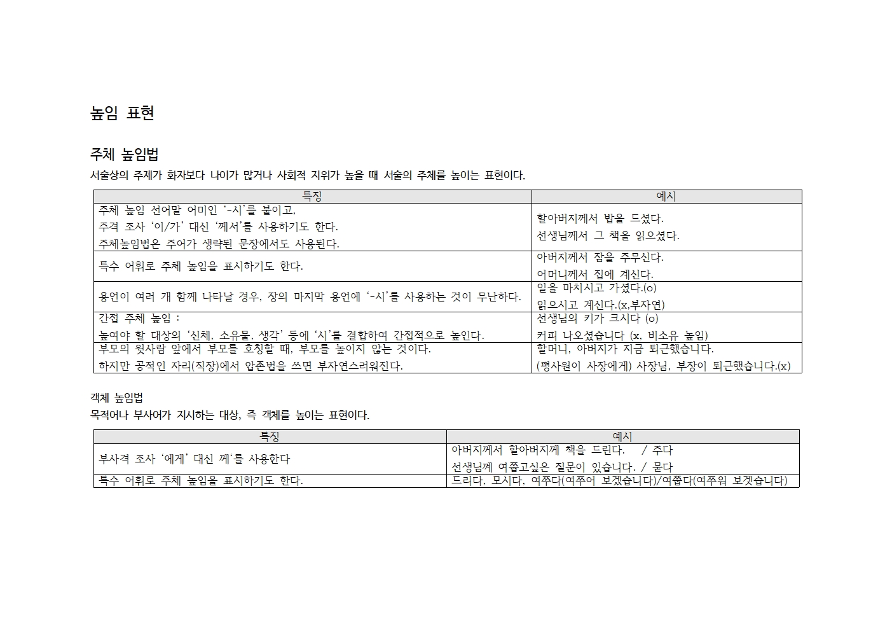
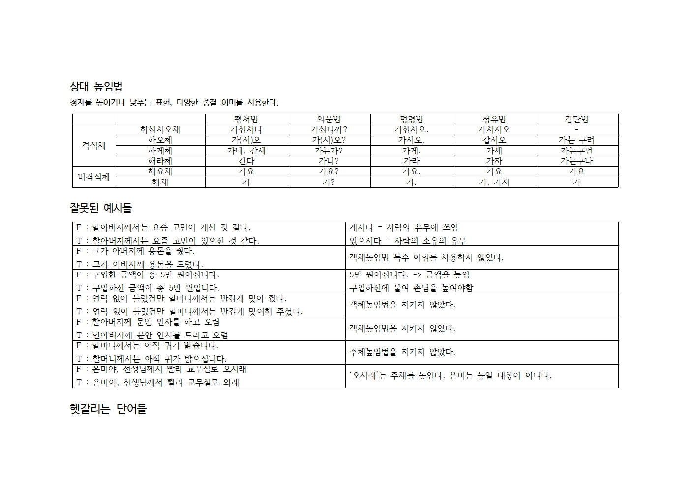
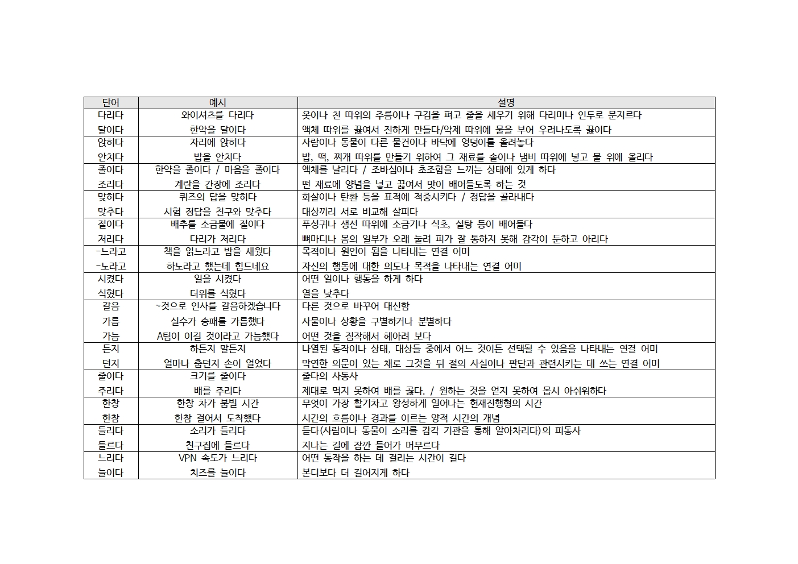
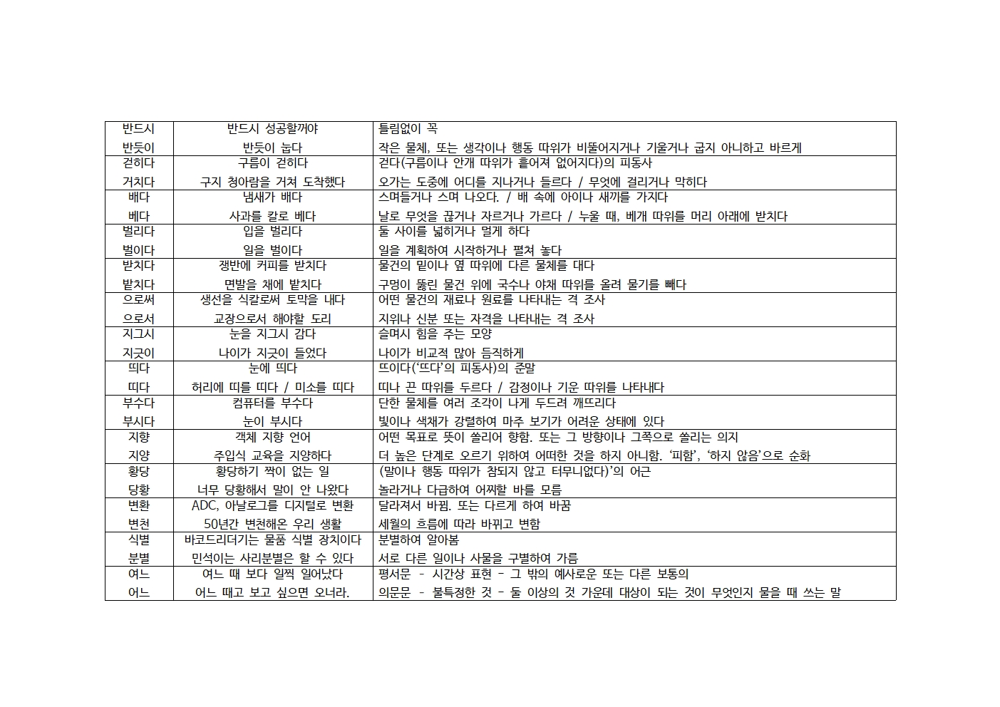
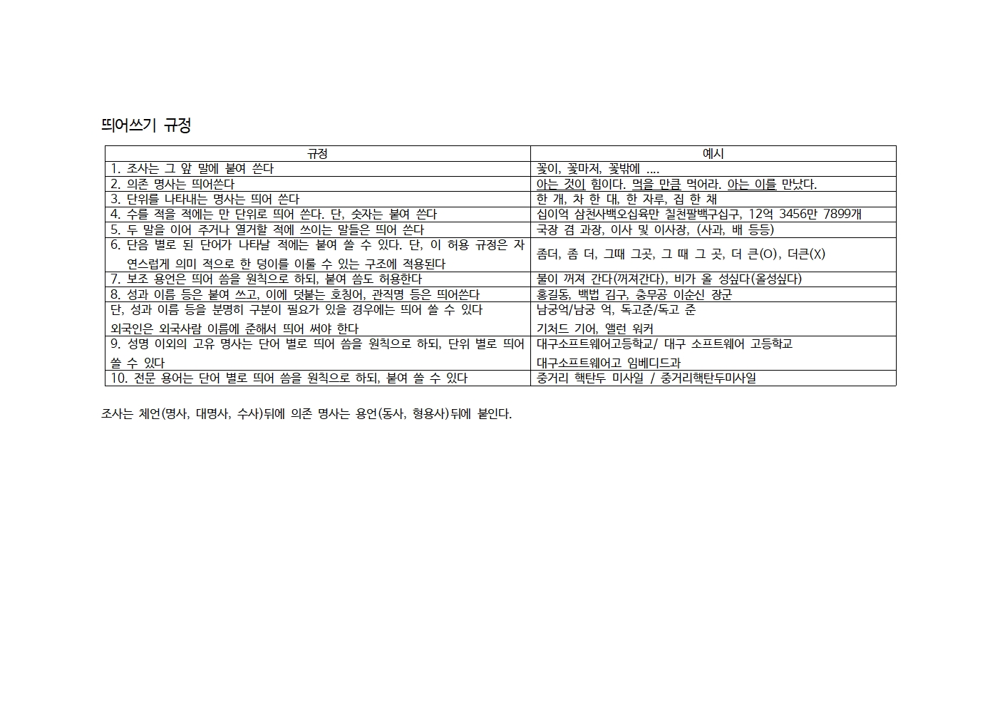

# 화작정리 - [배수한](https://github.com/SoohanBae)
※ 한컴파일도 같이 올렸습니다. - [GitHub] (https://github.com/tbvjaos510/DGSW-Exam/raw/master/2%ED%95%99%EB%85%84%202%ED%95%99%EA%B8%B0%20%EA%B8%B0%EB%A7%90/%ED%99%94%EC%9E%91/%EA%B5%AD%EC%96%B4.hwp) [드리이브 다운로드](https://drive.google.com/file/d/1vQppkvcU6OZDEOjfUdFwWp07CDFOOzIU/view?usp=sharing)  
※ Word 문서 - [GitHub] (https://github.com/tbvjaos510/DGSW-Exam/raw/master/2%ED%95%99%EB%85%84%202%ED%95%99%EA%B8%B0%20%EA%B8%B0%EB%A7%90/%ED%99%94%EC%9E%91/%EA%B5%AD%EC%96%B4.docx)
※ 상희가 정리한 [README.md](./README2.md)

## 높임말

## 혼동하기 쉬운 단어들

## 맞춤법 문제 - 퀴즈렛
[퀴즈렛 링크](https://quizlet.com/_5pgt13)

## 띄어쓰기

