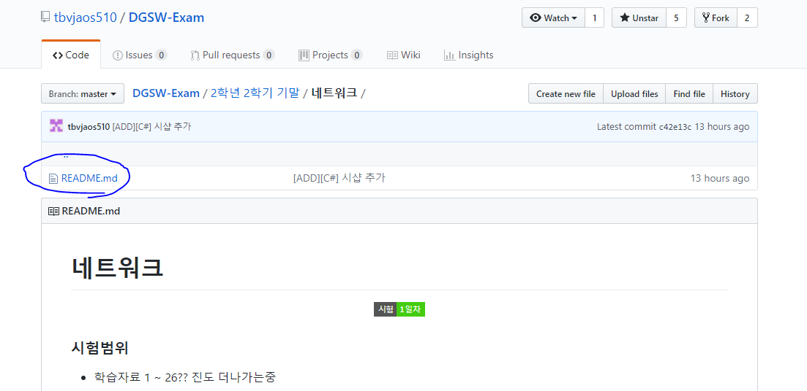
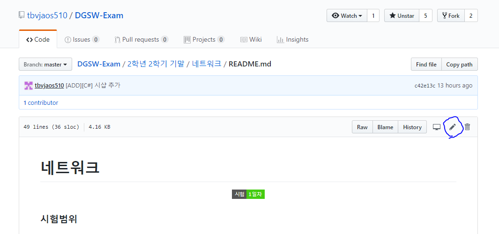
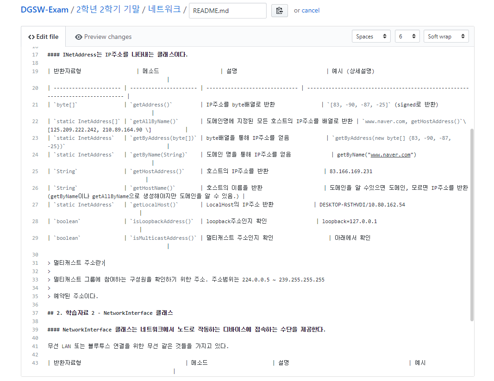
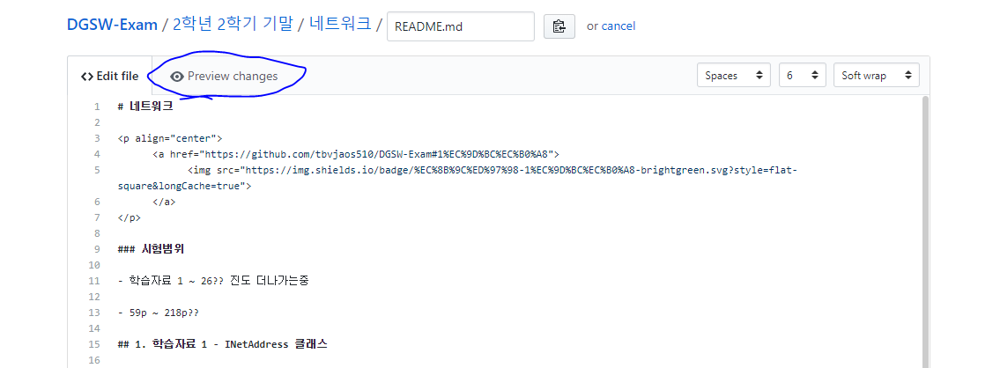
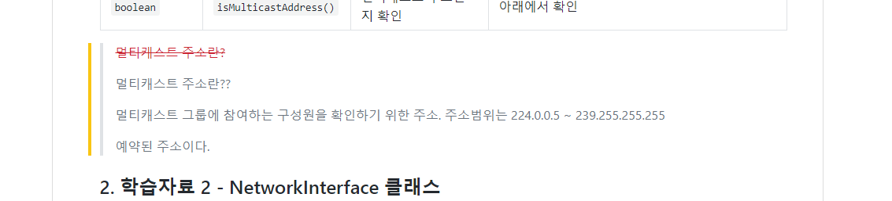
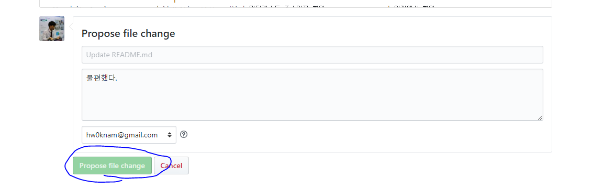
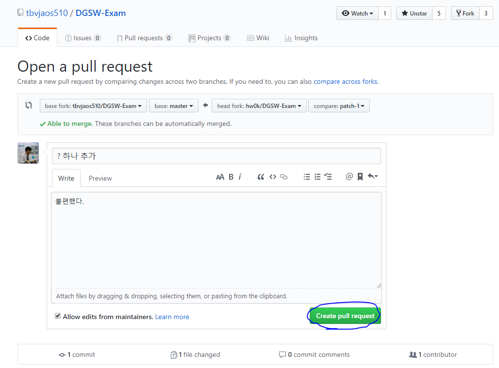
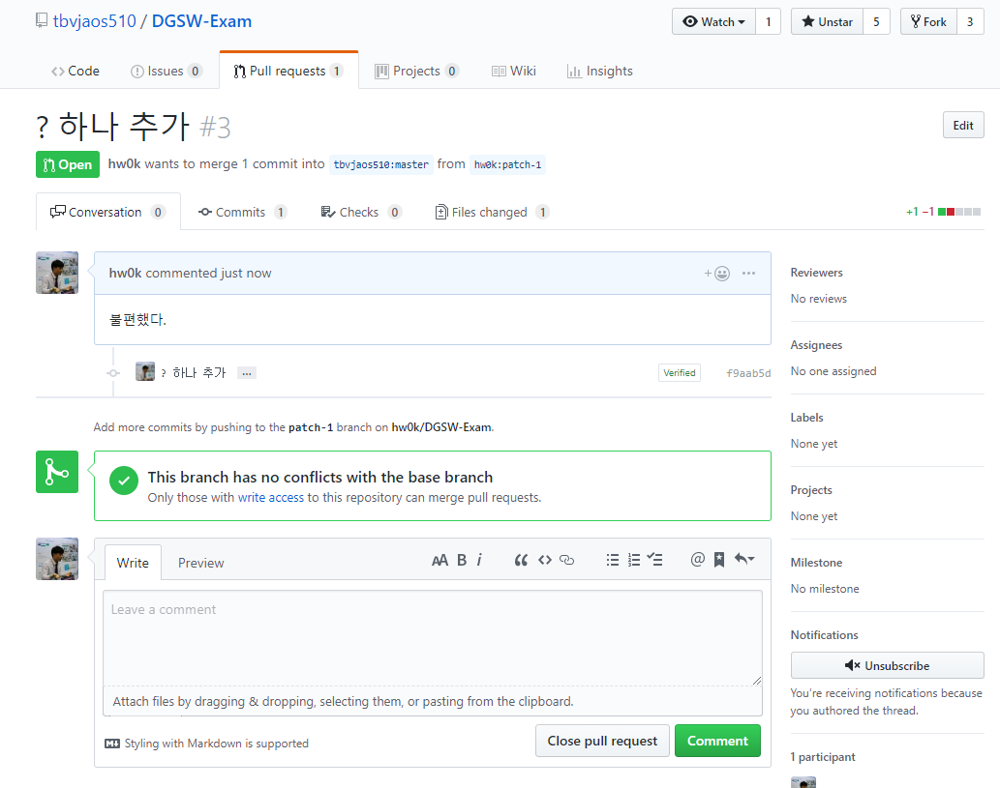
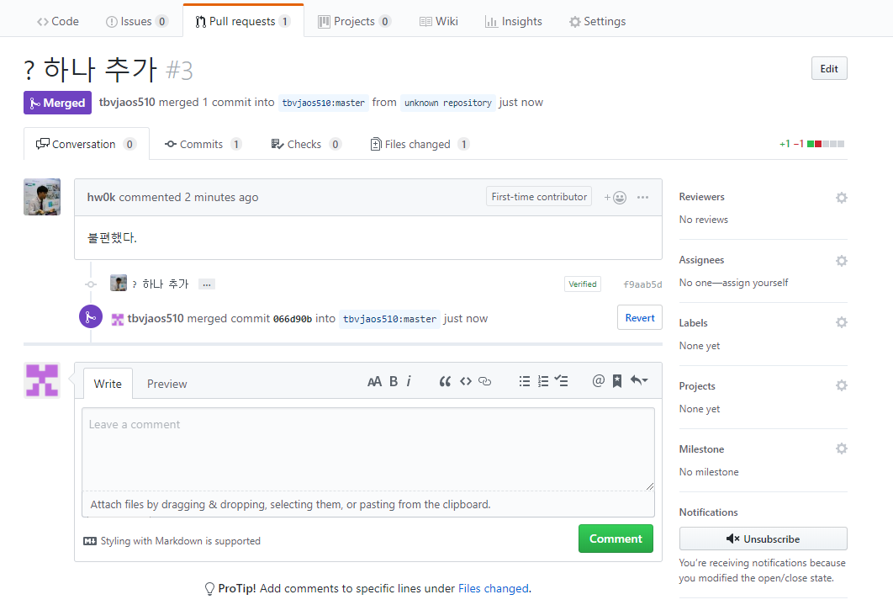

# 오류 수정 및 풀 리퀘스트

### 1. 수정 해야 할 파일 상단에서 해당 파일을 클릭한다.

### 2. 수정 버튼을 누른다.

### 3. 수정을 한다

**마크 다운 문서라서 텍스트가 조금 복잡하게 돼있다. 몇몇 텍스트만 수정하는것을 추천**

만약 수정할게 많으면 직접 찾아오면 더 자세히 설명해 주겠다.

### 4. 수정사항을 확인한다.

Preview change를 클릭하면 수정 사항을 볼 수 있다.

이를 통해 제대로 수정됐는지 확인한다.

### 5. Propose 한다.

파일 수정 사항을 추가하는 것이다.

### 6. Pull request 를 한다.

> Create pull request 버튼을 클릭한다,

### 7. 한번더 Pull request를 클릭한다

더 자세한 사항을 적고 싶으면 적은 뒤에 Pull request를 클릭한다.

### 8. 끝!

### 추후에 반영이 된다.

