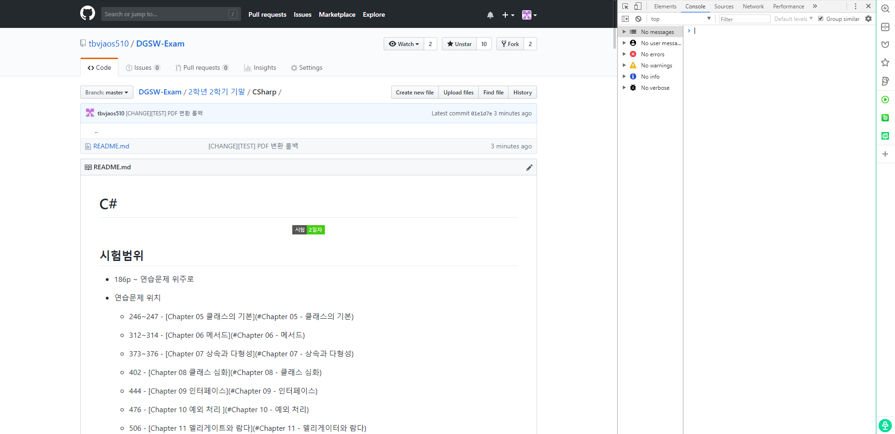
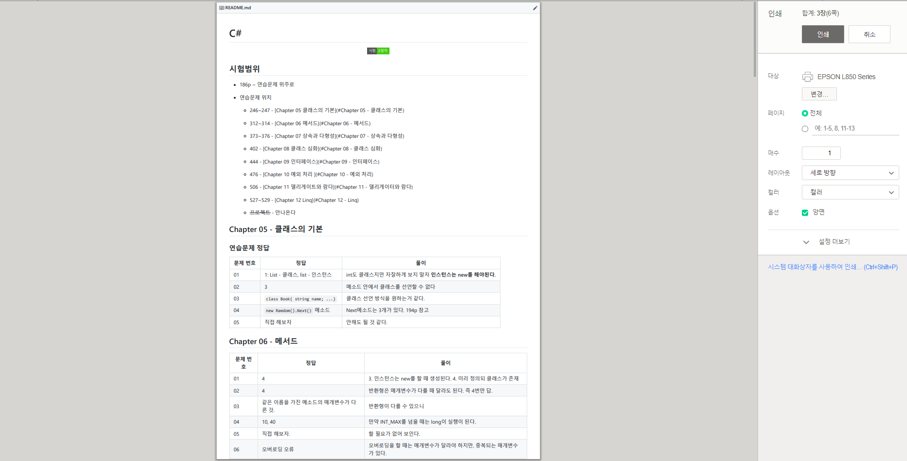

# 프린트 하는 법

## 1.  보고 있는 문서 페이지에서 F12를 누릅니다.



본 창은 브라우저마다 다르게 표시될 수 있습니다.

## 2. 콘솔 페이지에서 아래 스크립트를 붙여넣기 합니다.

```javascript
document
  .querySelector("#readme")
  .setAttribute(
    "style",
    "position: absolute; top: 0; left: 0; right: 0; bottom: 0; z-index: 100; background-color: white"
  );
document.querySelector("body").appendChild(document.querySelector("#readme"));
window.print();
```

## 3. 프린트창이 뜹니다.



## 끝!

### 참고로 옵션에서 설정 더보기 > 배경 그래픽을 선택하시면 코드가 더 간지납니다.
